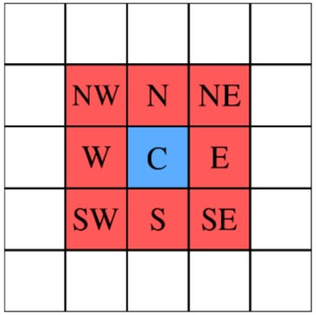
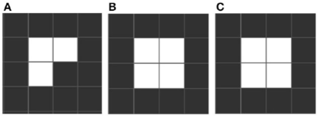
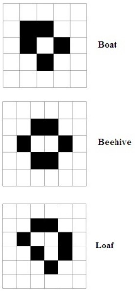
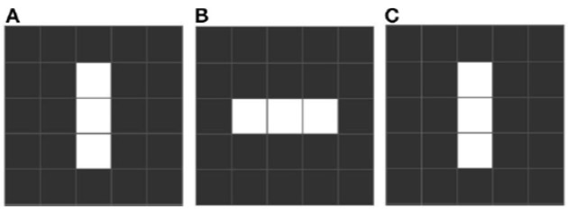
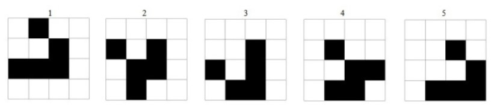
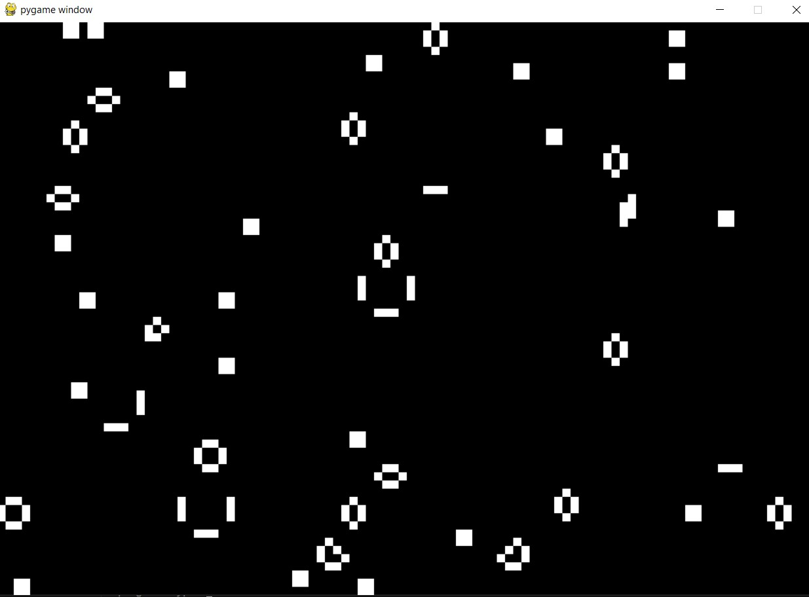

# Repository-for-the-Software-and-Computing-for-Applied-Physics-Project
This repository is intended to be a simulation of Conway's Game of life. The goal of the project is to obtain a Pygame window in which the evolution of the cellular automaton (i.e. Conway's game of life) is shown state by state in real time.
First, it is advisable to create a virtual environment within a new folder in which you want to run the project.
In order to use the project, Git must be installed. 
Then type the following command from the terminal:  
- git clone https://github.com/AldoCanfora/Repository-for-the-Software-and-Computing-for-Applied-Physics-Project
  
Next, installation of the following libraries is required: 
-numpy 
-pygame 
-pytest

The pytest library is required only for testing functions of [testing](testing.py).

To view the output of the project run the following code from the terminal:  
**"python cellular_automata_visualization.py"**
  
Then enter from the terminal the name of the configuration file you want to use, if you do not want to add a new configuration file you can type in the default one which is configuration.txt .
After entering the name of the configuration file you intend to use from the terminal, the pygame window appears on the screen and you can view the evolution of Conway's game of life with the [configuration](configuration.txt) parameters entered.

## Structure of the project
These are the steps in order to start the program and to show the results:

Modify the [configuration](configuration.txt) file to use a different configurations fot the outuput. The parameterts are: 
- WIDTH and HEIGHT: for the size of the grid, the minimum selectable values WIDTH and HEIGHT are greater than 20, to have a grid of at least 2 by 2;
- seed_value: for random cells generation;
- border_type: for a different state configuration of the outer edges of the grid. 
The allowed border_types are:
- death : cells outside the grid are all considered dead;
- alive : cells outside the grid are considered all alive;
- reflective : cells outside the grid assume the same state as the adjacent cell laterally;
- toroidal : The grid is considered to be wrapped around itself both horizontally and vertically so that there is no real "off grid".

The actual grid used in [cellular_automata_visualization](cellular_automata_visualization.py) is scaled by going to divide both WIDTH and HEIGHT by 10, approximating the result by default to the nearest integer.
In the file [cellular_automata](cellular_automata.py) there are functions to set randomly a configuration of alive or death cells in the grid, count neighbors, implement game of life's rules and update the state of the grid.
In the file [cellular_automata_visualization](cellular_automata_visualization.py) there is the pygame code to show the window where we can se the updating of the states of the game of life.
Then, to start the Conway's Game of Life algortihm the user has to launch the file [cellular_automata](cellular_automata.py) which imports its parameters from [configuration](configuration.txt). 
Running the file [cellular_automata](cellular_automata.py), with the command entered by the user **"python cellular_automata.py"**, through Pygame library, will display a window where you can see the time evolution of the Conway's Game of Life.

This is how I divided my project into blocks:

- In the file [cellular_automata](cellular_automata.py) I have built the Conway's Game of life functions that randomly initialize the grid, count the number of neighbors in each cell, update the grid state.
- In the file [cellular_automata_visualization](cellular_automata_visualization.py) there is the pygame code to show the window where we can se the updating of the states of the game of life.

- In the file [testing](testing.py) I have tested all the [cellular_automata](cellular_automata.py) functions to ensure that all of them work properly, using differet assert based on border_type parameters. For the other functions to be tested, I used examples of grids on which to make asserts. In addition, I included testing functions for special cases, such as all live cells or all death cells and emergent forms.

- In the file [configuration](configuration.txt) there are the definitions of the parameters used in the [cellular_automata](cellular_automata.py) and [testing](testing.py), there are definitions of WIDTH, HEIGHT, seed_value and border_type.
  
## Results of the project
In the [images](images) folder I have included some images to understand Conway's Game of life theory and an example of the output of [cellular_automata_visualization](cellular_automata_visualization.py).

## Cellular Automaton
A cellular automaton is a discrete model of computation studied in automata theory. 
Cellular automata have found application in various areas, including physics, theoretical
biology and microstructure modeling.
A cellular automaton consists of a regular grid of cells, each in one of a finite number
of states, such as on and off. The grid can be in any finite number of dimensions.
For each cell, a set of cells called its neighborhood, is defined relative to the specified
cell. An initial state (time t = 0) is selected by assigning a state for each cell. A
new generation is created (advancing t by 1), according to some fixed rule (generally,
a mathematical function) that determines the new state of each cell in terms of the
current state of the cell and the states of the cells in its neighborhood. The
rule for updating the state of cells is the same for each cell and does not change over
time, and is applied to the whole grid simultaneously.

In the above figure, this cellular automaton is a grid composed by 25 cells. The set of neighbor-
hood is called Moore Neighborhood and it is defined on a two-dimensional square lattice
and it is composed of a central cell and the eight cells that surround it, here indicated
with initials of cardinal points.

 ## Conway’s Game of Life
The Game of Life, also known simply as Life, is a cellular automaton devised by the
British mathematician John Horton Conway in 1970. It is a zero-player game,
meaning that its evolution is determined by its initial state, requiring no further input.
One interacts with the Game of Life by creating an initial configuration and observing
how it evolves. It is Turing complete and can simulate a universal constructor or any
other Turing machine. The universe of the Game of Life is an infinite, two-dimensional
orthogonal grid of square cells, each of which is in one of two possible states, live or
dead (or populated and unpopulated, respectively). Every cell interacts with its eight
neighbours, which are the cells that are horizontally, vertically, or diagonally adjacent.
At each step in time, the following transitions occur:

- Any live cell with fewer than two live neighbours dies, as if by underpopulation.
- Any live cell with two or three live neighbours lives on to the next generation.
- Any live cell with more than three live neighbours dies, as if by overpopulation.
- Any dead cell with exactly three live neighbours becomes a live cell, as if by reproduction.

These rules, which compare the behavior of the automaton to real life, can be con-
densed into the following:
- Any live cell with two or three live neighbours survives.
- Any dead cell with three live neighbours becomes a live cell.
- All other live cells die in the next generation. Similarly, all other dead cells stay dead.

The initial pattern constitutes the seed of the system. The first generation is created
by applying the above rules simultaneously to every cell in the seed, live or dead; births
and deaths occur simultaneously, and the discrete moment at which this happens is
sometimes called a tick.
The rules continue to be applied repeatedly to create further generations.

### Emergent forms
As is a property of complex systems, the operation of these rules produces emergent new forms, with properties that are not
predictable from the initial conditions. These new forms and properties do not involve
changes in initial conditions, since the counters are unchanged, but in the emergent
forms, the configurations that emerge, and their properties.

Conway identifies three distinctive emergent forms. 
- “Still life”
- “Blinker”
- “Movers” which include “Gliders”, which move across the grid.

In figure above, an example of a still life. The pattern stabilizes into a fixed form.

There are also other stable forms such as those shown in the figure above.

In figre above an example of a blinker, which is a pattern that oscillates with a fixed period,
that is, after n iterations the pattern returns to a previously visited state. In the example
this pattern has period 2.

The glider is a repeating pattern that travels across the grid. Their movement is diagonal in cellular grid  
and after one period come back to initial pattern and this procedure continues.
Therefore important feature of gliders is their movement in cellular grid. Figure above shows a glider whit period 4. 

In the figure below I show a frame of a state of the [cellular_automata](cellular_automata.py) viewed through the Pygame window.

